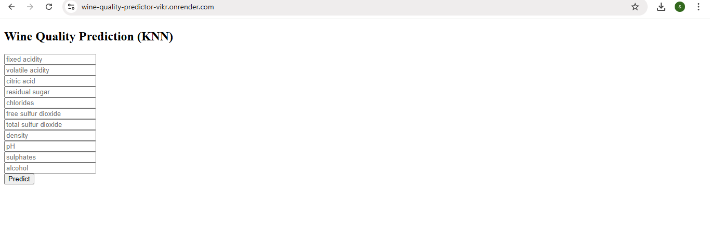
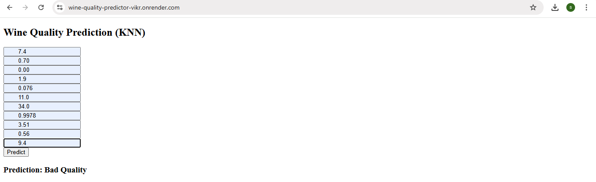
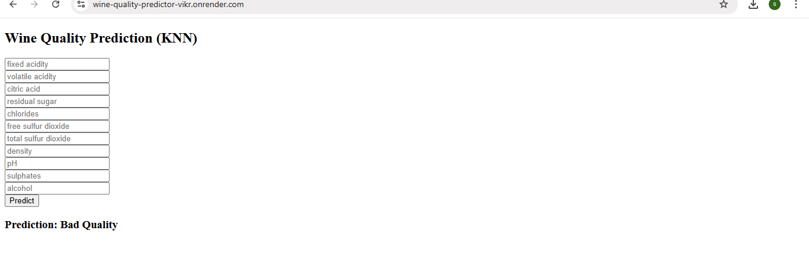

# wine-quality-predictor

This project uses the K-Nearest Neighbors (KNN) algorithm to classify red wine samples as either Good Quality or Bad Quality based on their chemical attributes. The dataset (WineQT.csv) contains physicochemical features of red wines, such as acidity, sugar, alcohol content, and pH.

---

## Features

- Accepts 11 chemical input features of red wine (e.g., alcohol, pH, acidity).
- Uses a trained KNN model to classify wine as Good or Bad quality.
- Simple and responsive web interface built with Flask and HTML/CSS.
- Displays prediction results instantly after form submission.
- Easily deployable on Render and customizable with new models or data.

---

## Prerequisites

Make sure the following are installed:

- Python 3.7 or higher installed
- Git installed and configured
- Basic knowledge of Python and Flask
- A GitHub account (for code hosting)
- Render account (for deployment)

---

## Installation

### 1. Clone the repository

```
git clone https://github.com/sandhiya0147/wine-quality-predictor.git
cd wine-quality-predictor
```

### 2. Install dependencies

```
pip install -r requirements.txt
```

---

## Running the Application

Start the Flask development server:

```
python app.py
```

Then open your browser and go to:

```
http://127.0.0.1:5000
```

---

## How It Works

- The user enters 11 wine properties into the web form.
- The app collects and formats the inputs in the required order.
- The trained KNN model loads and processes the input data.
- The model predicts whether the wine is of Good or Bad quality.
- The prediction is displayed clearly on the webpage with appropriate labeling.

---

## File Structure

```
wine-quality-predictor/
├── assets/
│   └── [optional images or screenshots]
├── static/
│   └── style.css
├── templates/
│   └── index.html
├── app.py
├── model_train.py
├── model.pkl
├── feature_columns.pkl
├── target_names.pkl
├── wineQT.csv
├── requirements.txt
├── Procfile
└── README.md         
```

---

## Future Improvements

- Add model comparison – allow users to switch between KNN, SVM, and Decision Tree models.
- Display confidence scores – show how confident the model is in each prediction.
- Input validation and tooltips – guide users with input hints, min-max ranges, and auto-formatting.
- Interactive data visualization – add graphs for feature impact, prediction trends, or correlations.
- User feedback logging – let users rate predictions to improve model retraining over time.

---


## Step-by-Step Guide: How to Use the Movie Interest Predictor


### Step 1: Input Form
  

### Step 2: Filled Form 
  

### Step 3: Prediction Result


---

## Live Demo

[Click here to view the deployed app](https://wine-quality-predictor-vikr.onrender.com)

---
